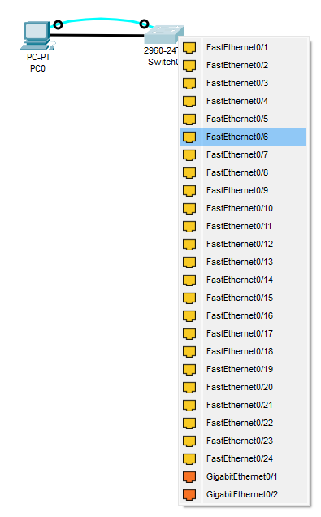

# Лабораторная работа №1. Базовая настройка коммутатора
### Задача:
1. Проверка конфигурации коммутатора по умолчанию
2. Создание сети и настройка основных параметров устройства
   - Настройте базовые параметры коммутатора.
   - Настройте IP-адрес для ПК.
3. Проверка сетевых подключений
   - Отобразите конфигурацию устройства
   - Протестируйте сквозное соединение, отправив эхо-запрос.
   - Протестируйте возможности удаленного управления с помощью Telnet.

### Решение:
1. [Создание сети и проверка настроек коммутатора по умолчанию](https://github.com/necit137/otus_study/blob/main/lab%2001/README.md#часть-1-создание-сети-и-проверка-настроек-коммутатора-по-умолчанию)
   - [Шаг 1. Создаем сеть, согласно топологии](https://github.com/necit137/otus_study/blob/main/lab%2001/README.md#шаг-1-создаем-сеть-согласно-топологии)
   - [Шаг 2. Проверяем настройки коммутатора по умолчанию](https://github.com/necit137/otus_study/edit/main/lab%2001/README.md#шаг-2-проверяем-настройки-коммутатора-по-умолчанию)
### Часть 1. Создание сети и проверка настроек коммутатора по умолчанию
#### Шаг 1. Создаем сеть, согласно топологии
Подключаем ПК к коммутатору через консольный кабель


#### вопросы к шагу:
- **Почему нужно использовать консольное подключение для первоначальной настройки коммутатора?**
- **Почему нельзя подключиться к коммутатору через Telnet или SSH?**
#### ответы к шагу:
- первичная настройка коммутатора возможна только через консоль.
- нельзя подключиться через Telnet или SSH, так как коммутатор не настроен для работы в сети.
#### Шаг 2. Проверяем настройки коммутатора по умолчанию

**a. проверяем наличие файла конфигурации коммутатора:**
```
Switch>enable
Switch#show running-config 
Building configuration...

Current configuration : 1080 bytes
!
version 15.0
no service timestamps log datetime msec
no service timestamps debug datetime msec
no service password-encryption
!
hostname Switch
!
!
!
!
!
!
spanning-tree mode pvst
spanning-tree extend system-id
!
interface FastEthernet0/1
!
interface FastEthernet0/2
!
interface FastEthernet0/3
!
interface FastEthernet0/4
!
interface FastEthernet0/5
!
interface FastEthernet0/6
!
interface FastEthernet0/7
!
interface FastEthernet0/8
!
interface FastEthernet0/9
!
interface FastEthernet0/10
!
interface FastEthernet0/11
!
interface FastEthernet0/12
!
interface FastEthernet0/13
!
interface FastEthernet0/14
!
interface FastEthernet0/15
!
interface FastEthernet0/16
!
interface FastEthernet0/17
!
interface FastEthernet0/18
!
interface FastEthernet0/19
!
interface FastEthernet0/20
!
interface FastEthernet0/21
!
interface FastEthernet0/22
!
interface FastEthernet0/23
!
interface FastEthernet0/24
!
interface GigabitEthernet0/1
!
interface GigabitEthernet0/2
!
interface Vlan1
 no ip address
 shutdown
!
!
!
!
line con 0
!
line vty 0 4
 login
line vty 5 15
 login
!
!
!
!
end
```
**b. Изучаем файл running configuration:**

Согласно файлу конфигурации на коммутаторе 2960 имеется 24 интерфейса FastEthernet и 2 интерфейса Gigabit Ethernet. Диапазон значений, отображаемых в vty-линиях от 0 до 15.

**c. Изучаем файл загрузочной конфигурации (startup-config):**

```
Switch#show startup-config 
startup-config is not present
```
сообщение "startup-config is not present" означает что в NVRAM отсутствует сохраненный файл конфигурации.

**d. Изучаем характеристики SVI для VLAN 1**
```
Switch#show interface vlan1
Vlan1 is administratively down, line protocol is down
  Hardware is CPU Interface, address is 000c.8519.3c72 (bia 000c.8519.3c72)
  MTU 1500 bytes, BW 100000 Kbit, DLY 1000000 usec,
     reliability 255/255, txload 1/255, rxload 1/255
  Encapsulation ARPA, loopback not set
  ARP type: ARPA, ARP Timeout 04:00:00
  Last input 21:40:21, output never, output hang never
  Last clearing of "show interface" counters never
  Input queue: 0/75/0/0 (size/max/drops/flushes); Total output drops: 0
  Queueing strategy: fifo
  Output queue: 0/40 (size/max)
  5 minute input rate 0 bits/sec, 0 packets/sec
  5 minute output rate 0 bits/sec, 0 packets/sec
     1682 packets input, 530955 bytes, 0 no buffer
     Received 0 broadcasts (0 IP multicast)
     0 runts, 0 giants, 0 throttles
     0 input errors, 0 CRC, 0 frame, 0 overrun, 0 ignored
     563859 packets output, 0 bytes, 0 underruns
     0 output errors, 23 interface resets
     0 output buffer failures, 0 output buffers swapped out
```
IP-адрес сети VLAN 1 не назначен. SVI имеет MAC-адрес: *000c.8519.3c72*. Сам интерфейс выключен.

**e. Изучаем IP-свойства интерфейса SVI сети VLAN 1**
```
Switch#show ip interface vlan1
Vlan1 is administratively down, line protocol is down
  Internet protocol processing disabled
```
**f.  подклюючаем кабель Ethernet компьютера PC-A к порту FE0/6 на коммутаторе и изучите IP-свойства интерфейса SVI сети VLAN 1**


