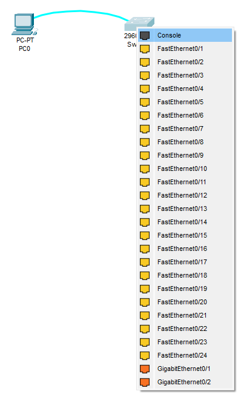

# Лабораторная работа №1. Базовая настройка коммутатора
### Задача:
1. Проверка конфигурации коммутатора по умолчанию
2. Создание сети и настройка основных параметров устройства
   - Настройте базовые параметры коммутатора.
   - Настройте IP-адрес для ПК.
3. Проверка сетевых подключений
   - Отобразите конфигурацию устройства
   - Протестируйте сквозное соединение, отправив эхо-запрос.
   - Протестируйте возможности удаленного управления с помощью Telnet.

### Решение:
1. [Часть 1. Создание сети и проверка настроек коммутатора по умолчанию]

### Часть 1. Создание сети и проверка настроек коммутатора по умолчанию

