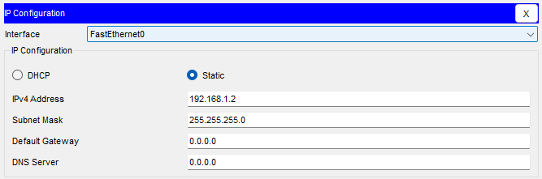
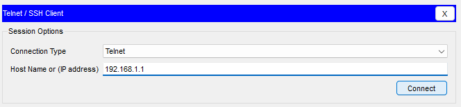

# Лабораторная работа №1. Базовая настройка коммутатора
### Задача:
1. Проверка конфигурации коммутатора по умолчанию
2. Создание сети и настройка основных параметров устройства
   - Настройте базовые параметры коммутатора.
   - Настройте IP-адрес для ПК.
3. Проверка сетевых подключений
   - Отобразите конфигурацию устройства
   - Протестируйте сквозное соединение, отправив эхо-запрос.
   - Протестируйте возможности удаленного управления с помощью Telnet.

### Решение:
1. [Создание сети и проверка настроек коммутатора по умолчанию](https://github.com/necit137/otus_study/blob/main/lab%2001/README.md#часть-1-создание-сети-и-проверка-настроек-коммутатора-по-умолчанию)
   - [Шаг 1. Создаем сеть, согласно топологии](https://github.com/necit137/otus_study/blob/main/lab%2001/README.md#шаг-1-создаем-сеть-согласно-топологии)
   - [Шаг 2. Проверяем настройки коммутатора по умолчанию](https://github.com/necit137/otus_study/edit/main/lab%2001/README.md#шаг-2-проверяем-настройки-коммутатора-по-умолчанию)
        - [a. проверяем наличие файла конфигурации коммутатора](https://github.com/necit137/otus_study/edit/main/lab%2001/README.md#a-проверяем-наличие-файла-конфигурации-коммутатора)
        - [b. Изучаем файл *running configuration*](https://github.com/necit137/otus_study/edit/main/lab%2001/README.md#b-изучаем-файл-running-configuration)
        - [c. Изучаем файл загрузочной конфигурации (startup-config)](https://github.com/necit137/otus_study/edit/main/lab%2001/README.md#c-изучаем-файл-загрузочной-конфигурации-startup-config)
        - [d. Изучаем характеристики SVI для VLAN 1](https://github.com/necit137/otus_study/edit/main/lab%2001/README.md#d-изучаем-характеристики-svi-для-vlan-1)
        - [e. Изучаем IP-свойства интерфейса SVI сети VLAN 1](https://github.com/necit137/otus_study/edit/main/lab%2001/README.md#e-изучаем-ip-свойства-интерфейса-svi-сети-vlan-1)
        - [f. Подключаем кабель Ethernet компьютера PC-A к порту FE0/6 на коммутаторе и изучите IP-свойства интерфейса SVI сети VLAN 1](https://github.com/necit137/otus_study/edit/main/lab%2001/README.md#f-подклюючаем-кабель-ethernet-компьютера-pc-a-к-порту-fe06-на-коммутаторе-и-изучите-ip-свойства-интерфейса-svi-сети-vlan-1)
        - [g. Изучаем сведения о версии ОС Cisco IOS на коммутаторе](https://github.com/necit137/otus_study/edit/main/lab%2001/README.md#g-изучаем-сведения-о-версии-ос-cisco-ios-на-коммутаторе)
        - [h. Изучаем свойства по умолчанию интерфейса FastEthernet 0/6, который используется компьютером PC-A.](https://github.com/necit137/otus_study/edit/main/lab%2001/README.md#h-изучаем-свойства-по-умолчанию-интерфейса-fastethernet-06-который-используется-компьютером-pc-a)
        - [i. Изучаем флеш-память](https://github.com/necit137/otus_study/edit/main/lab%2001/README.md#i-изучаем-флеш-память)
2. [Настройка базовых параметров сетевых устройств](https://github.com/necit137/otus_study/edit/main/lab%2001/README.md#часть-2-настройка-базовых-параметров-сетевых-устройств)
   - [Шаг 1. Настройте базовые параметры коммутатора](https://github.com/necit137/otus_study/edit/main/lab%2001/README.md#шаг-1-настройте-базовые-параметры-коммутатора)
        - [a. В режиме глобальной конфигурации, прописываем следующие базовые параметры конфигурации  на коммутаторе S1](https://github.com/necit137/otus_study/edit/main/lab%2001/README.md#a-в-режиме-глобальной-конфигурации-прописываем-следующие-базовые-параметры-конфигурации--на-коммутаторе-s1)
        - [b. Назначаем IP-адрес интерфейсу SVI на коммутаторе](https://github.com/necit137/otus_study/edit/main/lab%2001/README.md#b-назначаем-ip-адрес-интерфейсу-svi-на-коммутаторе)
        - [c. Ограничиваем доступ через порт консоли с помощью пароля](https://github.com/necit137/otus_study/edit/main/lab%2001/README.md#c-ограничиваем-доступ-через-порт-консоли-с-помощью-пароля)
        - [d. Защита доступа к линии VTY](https://github.com/necit137/otus_study/edit/main/lab%2001/README.md#d-защита-доступа-к-линии-vty)
   - [Шаг 2. Настройка IP-адреса на компьютере PC-A](https://github.com/necit137/otus_study/edit/main/lab%2001/README.md#шаг-2-настройка-ip-адреса-на-компьютере-pc-a)
3. [Часть 3. Проверка сетевых подключений](https://github.com/necit137/otus_study/edit/main/lab%2001/README.md#часть-3-проверка-сетевых-подключений)
   - [Шаг 1. Отображение конфигурации коммутатора.](https://github.com/necit137/otus_study/edit/main/lab%2001/README.md#шаг-1-отображение-конфигурации-коммутатора)
        - [a. Пример конфигурации настроенного коммутатора](https://github.com/necit137/otus_study/edit/main/lab%2001/README.md#a-пример-конфигурации-настроенного-коммутатора)
        - [b. Проверка параметров VLAN 1](https://github.com/necit137/otus_study/edit/main/lab%2001/README.md#b-проверка-параметров-vlan-1)
   - [Шаг 2. Тестирование сквозное соединение, отправкой эхо-запроса](https://github.com/necit137/otus_study/edit/main/lab%2001/README.md#шаг-2-тестирование-сквозное-соединение-отправкой-эхо-запроса)
        - [a. проверка адреса персонального компьютера PC-A утилитой *Ping*](https://github.com/necit137/otus_study/edit/main/lab%2001/README.md#a-проверка-адреса-персонального-компьютера-pc-a-утилитой-ping)
        - [b. проверка адреса Коммутатора S1 утилитой *Ping*](https://github.com/necit137/otus_study/edit/main/lab%2001/README.md#b-проверка-адреса-коммутатора-s1-утилитой-ping)
   - [Шаг 3. Проверяем удаленное управление коммутатором S1](https://github.com/necit137/otus_study/edit/main/lab%2001/README.md#шаг-3-проверяем-удаленное-управление-коммутатором-s1)
### Часть 1. Создание сети и проверка настроек коммутатора по умолчанию
### Шаг 1. Создаем сеть, согласно топологии
Подключаем ПК к коммутатору через консольный кабель


**вопросы к шагу:**
- **Почему нужно использовать консольное подключение для первоначальной настройки коммутатора?**
- **Почему нельзя подключиться к коммутатору через Telnet или SSH?**

**ответы к шагу:**
- первичная настройка коммутатора возможна только через консоль.
- нельзя подключиться через Telnet или SSH, так как коммутатор не настроен для работы в сети.
### Шаг 2. Проверяем настройки коммутатора по умолчанию

#### a. проверяем наличие файла конфигурации коммутатора
```
Switch>enable
Switch#show running-config 
Building configuration...

Current configuration : 1080 bytes
!
version 15.0
no service timestamps log datetime msec
no service timestamps debug datetime msec
no service password-encryption
!
hostname Switch
!
!
!
!
!
!
spanning-tree mode pvst
spanning-tree extend system-id
!
interface FastEthernet0/1
!
interface FastEthernet0/2
!
interface FastEthernet0/3
!
interface FastEthernet0/4
!
interface FastEthernet0/5
!
interface FastEthernet0/6
!
interface FastEthernet0/7
!
interface FastEthernet0/8
!
interface FastEthernet0/9
!
interface FastEthernet0/10
!
interface FastEthernet0/11
!
interface FastEthernet0/12
!
interface FastEthernet0/13
!
interface FastEthernet0/14
!
interface FastEthernet0/15
!
interface FastEthernet0/16
!
interface FastEthernet0/17
!
interface FastEthernet0/18
!
interface FastEthernet0/19
!
interface FastEthernet0/20
!
interface FastEthernet0/21
!
interface FastEthernet0/22
!
interface FastEthernet0/23
!
interface FastEthernet0/24
!
interface GigabitEthernet0/1
!
interface GigabitEthernet0/2
!
interface Vlan1
 no ip address
 shutdown
!
!
!
!
line con 0
!
line vty 0 4
 login
line vty 5 15
 login
!
!
!
!
end
```
#### b. Изучаем файл *running configuration*

Согласно файлу конфигурации на коммутаторе 2960 имеется *24 интерфейса FastEthernet* и *2 интерфейса Gigabit Ethernet*. Диапазон значений, отображаемых в vty-линиях *от 0 до 15*.

#### c. Изучаем файл загрузочной конфигурации (startup-config):

```
Switch#show startup-config 
startup-config is not present
```
сообщение "startup-config is not present" означает что в NVRAM отсутствует сохраненный файл конфигурации.

#### d. Изучаем характеристики SVI для VLAN 1
```
Switch#show interface vlan1
Vlan1 is administratively down, line protocol is down
  Hardware is CPU Interface, address is 000c.8519.3c72 (bia 000c.8519.3c72)
  MTU 1500 bytes, BW 100000 Kbit, DLY 1000000 usec,
     reliability 255/255, txload 1/255, rxload 1/255
  Encapsulation ARPA, loopback not set
  ARP type: ARPA, ARP Timeout 04:00:00
  Last input 21:40:21, output never, output hang never
  Last clearing of "show interface" counters never
  Input queue: 0/75/0/0 (size/max/drops/flushes); Total output drops: 0
  Queueing strategy: fifo
  Output queue: 0/40 (size/max)
  5 minute input rate 0 bits/sec, 0 packets/sec
  5 minute output rate 0 bits/sec, 0 packets/sec
     1682 packets input, 530955 bytes, 0 no buffer
     Received 0 broadcasts (0 IP multicast)
     0 runts, 0 giants, 0 throttles
     0 input errors, 0 CRC, 0 frame, 0 overrun, 0 ignored
     563859 packets output, 0 bytes, 0 underruns
     0 output errors, 23 interface resets
     0 output buffer failures, 0 output buffers swapped out
```
IP-адрес сети VLAN 1 *не назначен*. SVI имеет MAC-адрес: *000c.8519.3c72*. Сам интерфейс *выключен*.

#### e. Изучаем IP-свойства интерфейса SVI сети VLAN 1
```
Switch#show ip interface vlan1
Vlan1 is administratively down, line protocol is down
  Internet protocol processing disabled
```
#### f. Подключаем кабель Ethernet компьютера PC-A к порту FE0/6 на коммутаторе и изучите IP-свойства интерфейса SVI сети VLAN 1


в консоли появляются строки, информирующие о подключении кабеля в порт 6:
```
%LINK-5-CHANGED: Interface FastEthernet0/6, changed state to up

%LINEPROTO-5-UPDOWN: Line protocol on Interface FastEthernet0/6, changed state to up
```
#### g. Изучаем сведения о версии ОС Cisco IOS на коммутаторе
```
Switch# show version
Cisco IOS Software, C2960 Software (C2960-LANBASEK9-M), Version 15.0(2)SE4, RELEASE SOFTWARE (fc1)
Technical Support: http://www.cisco.com/techsupport
Copyright (c) 1986-2013 by Cisco Systems, Inc.
Compiled Wed 26-Jun-13 02:49 by mnguyen

ROM: Bootstrap program is C2960 boot loader
BOOTLDR: C2960 Boot Loader (C2960-HBOOT-M) Version 12.2(25r)FX, RELEASE SOFTWARE (fc4)

Switch uptime is 39 minutes
System returned to ROM by power-on
System image file is "flash:c2960-lanbasek9-mz.150-2.SE4.bin"


This product contains cryptographic features and is subject to United
States and local country laws governing import, export, transfer and
use. Delivery of Cisco cryptographic products does not imply
third-party authority to import, export, distribute or use encryption.
Importers, exporters, distributors and users are responsible for
compliance with U.S. and local country laws. By using this product you
agree to comply with applicable laws and regulations. If you are unable
to comply with U.S. and local laws, return this product immediately.

A summary of U.S. laws governing Cisco cryptographic products may be found at:
http://www.cisco.com/wwl/export/crypto/tool/stqrg.html

If you require further assistance please contact us by sending email to
export@cisco.com.

cisco WS-C2960-24TT-L (PowerPC405) processor (revision B0) with 65536K bytes of memory.
Processor board ID FOC1010X104
Last reset from power-on
1 Virtual Ethernet interface
24 FastEthernet interfaces
2 Gigabit Ethernet interfaces
The password-recovery mechanism is enabled.

64K bytes of flash-simulated non-volatile configuration memory.
Base ethernet MAC Address       : 00:0C:85:19:3C:72
Motherboard assembly number     : 73-10390-03
Power supply part number        : 341-0097-02
Motherboard serial number       : FOC10093R12
Power supply serial number      : AZS1007032H
Model revision number           : B0
Motherboard revision number     : B0
Model number                    : WS-C2960-24TT-L
System serial number            : FOC1010X104
Top Assembly Part Number        : 800-27221-02
Top Assembly Revision Number    : A0
Version ID                      : V02
CLEI Code Number                : COM3L00BRA
Hardware Board Revision Number  : 0x01


Switch Ports Model              SW Version            SW Image
------ ----- -----              ----------            ----------
*    1 26    WS-C2960-24TT-L    15.0(2)SE4            C2960-LANBASEK9-M


Configuration register is 0xF
```
коммутатор работает под управлением версии ОС Cisco IOS *15.0(2)SE4*. 

Название файла образа системы: *"flash:c2960-lanbasek9-mz.150-2.SE4.bin"*

#### h. Изучаем свойства по умолчанию интерфейса FastEthernet 0/6, который используется компьютером PC-A
```
Switch#show interface fastEthernet 0/6
FastEthernet0/6 is up, line protocol is up (connected)
  Hardware is Lance, address is 00e0.b0b6.6806 (bia 00e0.b0b6.6806)
 BW 100000 Kbit, DLY 1000 usec,
     reliability 255/255, txload 1/255, rxload 1/255
  Encapsulation ARPA, loopback not set
  Keepalive set (10 sec)
  Full-duplex, 100Mb/s
  input flow-control is off, output flow-control is off
  ARP type: ARPA, ARP Timeout 04:00:00
  Last input 00:00:08, output 00:00:05, output hang never
  Last clearing of "show interface" counters never
  Input queue: 0/75/0/0 (size/max/drops/flushes); Total output drops: 0
  Queueing strategy: fifo
  Output queue :0/40 (size/max)
  5 minute input rate 0 bits/sec, 0 packets/sec
  5 minute output rate 0 bits/sec, 0 packets/sec
     956 packets input, 193351 bytes, 0 no buffer
     Received 956 broadcasts, 0 runts, 0 giants, 0 throttles
     0 input errors, 0 CRC, 0 frame, 0 overrun, 0 ignored, 0 abort
     0 watchdog, 0 multicast, 0 pause input
     0 input packets with dribble condition detected
     2357 packets output, 263570 bytes, 0 underruns
```
Согласно полученным выходным данным, мы можем понять, что данный интефейс включён. MAC-адрес интерфейса: *00e0.b0b6.6806*

если требуется включить интерфейс, прописыаем следующее:
```
Switch#configure terminal 
Enter configuration commands, one per line.  End with CNTL/Z.
Switch(config)#interface fastEthernet 0/6
Switch(config-if)#no shutdown 

%LINK-5-CHANGED: Interface FastEthernet0/6, changed state to up

%LINEPROTO-5-UPDOWN: Line protocol on Interface FastEthernet0/6, changed state to up

Switch#
%SYS-5-CONFIG_I: Configured from console by console
```
в интерфейсе настройки скорости и дуплекса заданы значением: *Full-duplex, 100Mb/s*

#### i. Изучаем флеш-память
Для отображения флеш-каталога воспользуемся командой *show flash*
```
Switch#show flash
Directory of flash:/

    1  -rw-     4670455          <no date>  2960-lanbasek9-mz.150-2.SE4.bin

64016384 bytes total (59345929 bytes free)
Switch#
```
или командой *dir flash:*
```
Switch#dir flash: 
Directory of flash:/

    1  -rw-     4670455          <no date>  2960-lanbasek9-mz.150-2.SE4.bin

64016384 bytes total (59345929 bytes free)
```
Мы видим, что нынешнему образу Cisco IOS присвоено имя: *"2960-lanbasek9-mz.150-2.SE4.bin"*

### Часть 2. Настройка базовых параметров сетевых устройств
### Шаг 1. Настройте базовые параметры коммутатора
#### a. В режиме глобальной конфигурации, прописываем следующие базовые параметры конфигурации  на коммутаторе S1:
```
Switch>enable
Switch#configure terminal 
Enter configuration commands, one per line.  End with CNTL/Z.
Switch(config)#no ip domain-lookup 
Switch(config)#hostname S1
S1(config)#service password-encryption 
S1(config)#enable secret class
S1(config)#banner motd #
Enter TEXT message.  End with the character '#'.
Unauthorized access is strictly prohibited. #
S1(config)#
```
#### b. Назначаем IP-адрес интерфейсу SVI на коммутаторе:
```
S1#configure terminal 
Enter configuration commands, one per line.  End with CNTL/Z.
S1(config)#interface vlan1
S1(config-if)#IP address 192.168.1.1 255.255.255.0
S1(config-if)#no shutdown 

S1(config-if)#
%LINK-5-CHANGED: Interface Vlan1, changed state to up

%LINEPROTO-5-UPDOWN: Line protocol on Interface Vlan1, changed state to up
```
#### c. Ограничиваем доступ через порт консоли с помощью пароля:
```
S1#configure terminal 
Enter configuration commands, one per line.  End with CNTL/Z.
S1(config)#line console 0
S1(config-line)#password cisco
S1(config-line)#login
```
#### d. Защита доступа к линии VTY:
```
S1(config)#line vty 0 15
S1(config-line)#password cisco
S1(config-line)#login
```
команда *Login* необходима для включения доступа к VTY.
### Шаг 2. Настройка IP-адреса на компьютере PC-A
На компьютере PC-A вводим IP-адресс и маску подсети:


### Часть 3. Проверка сетевых подключений
### Шаг 1. Отображение конфигурации коммутатора
#### a. Пример конфигурации настроенного коммутатора:
```
S1#show run
Building configuration...

Current configuration : 1318 bytes
!
version 15.0
no service timestamps log datetime msec
no service timestamps debug datetime msec
service password-encryption
!
hostname S1
!
enable secret 5 $1$mERr$9cTjUIEqNGurQiFU.ZeCi1
!
!
!
no ip domain-lookup
!
!
!
spanning-tree mode pvst
spanning-tree extend system-id
!
interface FastEthernet0/1
!
interface FastEthernet0/2
!
interface FastEthernet0/3
!
interface FastEthernet0/4
!
interface FastEthernet0/5
!
interface FastEthernet0/6
!
interface FastEthernet0/7
!
interface FastEthernet0/8
!
interface FastEthernet0/9
!
interface FastEthernet0/10
!
interface FastEthernet0/11
!
interface FastEthernet0/12
!
interface FastEthernet0/13
!
interface FastEthernet0/14
!
interface FastEthernet0/15
!
interface FastEthernet0/16
!
interface FastEthernet0/17
!
interface FastEthernet0/18
!
interface FastEthernet0/19
!
interface FastEthernet0/20
!
interface FastEthernet0/21
!
interface FastEthernet0/22
!
interface FastEthernet0/23
!
interface FastEthernet0/24
!
interface GigabitEthernet0/1
!
interface GigabitEthernet0/2
!
interface Vlan1
 ip address 192.168.1.1 255.255.255.0
!
banner motd ^C
Unauthorized access is strictly prohibited. ^C
!
!
!
line con 0
 password 7 0822455D0A16
 logging synchronous
 login
!
line vty 0 4
 password 7 0822455D0A16
 login
line vty 5 15
 password 7 0822455D0A16
 login
!
!
!
!
end


S1# 
```
#### b. Проверка параметров VLAN 1:
```
S1# show interfaces vlan1
Vlan1 is up, line protocol is up
  Hardware is CPU Interface, address is 000c.8519.3c72 (bia 000c.8519.3c72)
  Internet address is 192.168.1.1/24
  MTU 1500 bytes, BW 100000 Kbit, DLY 1000000 usec,
     reliability 255/255, txload 1/255, rxload 1/255
  Encapsulation ARPA, loopback not set
  ARP type: ARPA, ARP Timeout 04:00:00
  Last input 21:40:21, output never, output hang never
  Last clearing of "show interface" counters never
  Input queue: 0/75/0/0 (size/max/drops/flushes); Total output drops: 0
  Queueing strategy: fifo
  Output queue: 0/40 (size/max)
  5 minute input rate 0 bits/sec, 0 packets/sec
  5 minute output rate 0 bits/sec, 0 packets/sec
     1682 packets input, 530955 bytes, 0 no buffer
     Received 0 broadcasts (0 IP multicast)
     0 runts, 0 giants, 0 throttles
     0 input errors, 0 CRC, 0 frame, 0 overrun, 0 ignored
     563859 packets output, 0 bytes, 0 underruns
     0 output errors, 23 interface resets
     0 output buffer failures, 0 output buffers swapped out

S1#
```
Полоса пропускания (Bandwidth) данного интерфейса VLAN1 составляет *100000 Kbit*, то есть *100 Мбит/с*.
### Шаг 2. Тестирование сквозное соединение, отправкой эхо-запроса
#### a. проверка адреса персонального компьютера PC-A утилитой *Ping*:
```
C:\>ping 192.168.1.2

Pinging 192.168.1.2 with 32 bytes of data:

Reply from 192.168.1.2: bytes=32 time=3ms TTL=128
Reply from 192.168.1.2: bytes=32 time=2ms TTL=128
Reply from 192.168.1.2: bytes=32 time=2ms TTL=128
Reply from 192.168.1.2: bytes=32 time=2ms TTL=128

Ping statistics for 192.168.1.2:
    Packets: Sent = 4, Received = 4, Lost = 0 (0% loss),
Approximate round trip times in milli-seconds:
    Minimum = 2ms, Maximum = 3ms, Average = 2ms

C:\>
```
#### b. проверка адреса Коммутатора S1 утилитой *Ping*:
```
C:\>ping 192.168.1.1

Pinging 192.168.1.1 with 32 bytes of data:

Reply from 192.168.1.1: bytes=32 time<1ms TTL=255
Reply from 192.168.1.1: bytes=32 time<1ms TTL=255
Reply from 192.168.1.1: bytes=32 time<1ms TTL=255
Reply from 192.168.1.1: bytes=32 time<1ms TTL=255

Ping statistics for 192.168.1.1:
    Packets: Sent = 4, Received = 4, Lost = 0 (0% loss),
Approximate round trip times in milli-seconds:
    Minimum = 0ms, Maximum = 0ms, Average = 0ms

C:\>
```
### Шаг 3. Проверяем удаленное управление коммутатором S1
На компьютере PC-A, через сервер Telnet подключаемся к коммутатору S1:


```
Trying 192.168.1.1 ...Open
Unauthorized access is strictly prohibited. 


User Access Verification

Password: *cisco*
S1>enable
Password: *class*
S1#exit
S1#
```
**Ответ на вопросы для повторения:**
- Настройка пароля VTY требуется для возможности удаленого подключения через Telnet
- Чтобы пароли не отправлялись в незашифрованном виде, необходимо Включите шифрование паролей, задайте пароль на линиях VTY.
