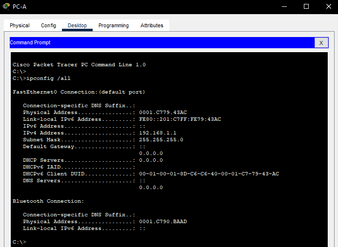

# Лабораторная работа №2. Просмотр таблицы MAC-адресов коммутатора 
### Задача:
1. Создание и настройка сети
2. Изучение таблицы МАС-адресов коммутатора

### Решение:
1. [Создание и настройка сети](https://github.com/necit137/otus_study/edit/main/lab%2002/README.md#часть-1-создание-и-настройка-сети)
    - [Шаг 1. Подключаем сеть в соответствии с топологией](https://github.com/necit137/otus_study/edit/main/lab%2002/README.md#шаг-1-подключаем-сеть-в-соответствии-с-топологией)
    - [Шаг 2. Настраиваем узлы ПК](https://github.com/necit137/otus_study/edit/main/lab%2002/README.md#шаг-2-настраиваем-узлы-пк)
    - [Шаг 3. Выполняем инициализацию и перезагрузку коммутаторов](https://github.com/necit137/otus_study/edit/main/lab%2002/README.md#шаг-3-выполните-инициализацию-и-перезагрузку-коммутаторов)
    - [Шаг 4. Настраиваем базовые параметры каждого коммутатора](https://github.com/necit137/otus_study/edit/main/lab%2002/README.md#шаг-4-настраиваем-базовые-параметры-каждого-коммутатора)
      - [a. Настраиваем имя устройства в соответствии с топологией](https://github.com/necit137/otus_study/edit/main/lab%2002/README.md#a-настраиваем-имя-устройства-в-соответствии-с-топологией)
      - [b.	Настраиваем IP-адреса, как указано в таблице адресации](https://github.com/necit137/otus_study/edit/main/lab%2002/README.md#bнастраиваем-ip-адреса-как-указано-в-таблице-адресации)
      - [c.	Назначаем cisco в качестве паролей консоли и VTY](https://github.com/necit137/otus_study/edit/main/lab%2002/README.md#cназначаем-cisco-в-качестве-паролей-консоли-и-vty)
      - [d.	Назначаем class в качестве пароля доступа к привилегированному режиму EXEC](https://github.com/necit137/otus_study/edit/main/lab%2002/README.md#dназначаем-class-в-качестве-пароля-доступа-к-привилегированному-режиму-exec)
2. [Изучение таблицы МАС-адресов коммутатора](https://github.com/necit137/otus_study/edit/main/lab%2002/README.md#часть-2-изучение-таблицы-мас-адресов-коммутатора)
    - [Шаг 1. Запишем МАС-адреса сетевых устройств](https://github.com/necit137/otus_study/edit/main/lab%2002/README.md#шаг-1-запишем-мас-адреса-сетевых-устройств)
      - [а.	Открываем командную строку на PC-A и PC-B и вводим команду ***ipconfig /all***](https://github.com/necit137/otus_study/edit/main/lab%2002/README.md#аоткрываем-командную-строку-на-pc-a-и-pc-b-и-вводим-команду-ipconfig-all)


### Часть 1. Создание и настройка сети
### Шаг 1. Подключаем сеть в соответствии с топологией


### Шаг 2. Настраиваем узлы ПК
Производим настройку PC-A


Производим настройку PC-B


### Шаг 3. Выполняем инициализацию и перезагрузку коммутаторов
Для первичного подключения к коммутаторам ***S1*** и ***S2***, подключаем к ним компьютер PC-A через COM-порт. 


Командой ***erase startup-config*** удаляем все конфигурации на коммутаторе: 
```
Switch#erase startup-config 
Erasing the nvram filesystem will remove all configuration files! Continue? [confirm]
[OK]
Erase of nvram: complete
%SYS-7-NV_BLOCK_INIT: Initialized the geometry of nvram
```
после чего перезапускаем коммутатор коммандой ***reload***:
```
Switch#reload 
Proceed with reload? [confirm]
C2960 Boot Loader (C2960-HBOOT-M) Version 12.2(25r)FX, RELEASE SOFTWARE (fc4)
Cisco WS-C2960-24TT (RC32300) processor (revision C0) with 21039K bytes of memory.
2960-24TT starting...
```
Выполняем данные команды на обоих устройствах

### Шаг 4. Настраиваем базовые параметры каждого коммутатора 
Далее будет указана настройка первого коммутатора S1. Настройка коммутатора S2 проводится аналогично, по этому отражена в работе не будет. 
#### a. Настраиваем имя устройства в соответствии с топологией

```
Switch>enable
Switch#configure terminal 
Enter configuration commands, one per line.  End with CNTL/Z.
Switch(config)#no ip domain-lookup 
Switch(config)#hostname S1
S1(config)#
```
#### b.	Настраиваем IP-адреса, как указано в таблице адресации

```
S1#configure terminal 
Enter configuration commands, one per line.  End with CNTL/Z.
S1(config)#interface vlan1
S1(config-if)#ip address 192.168.1.11 255.255.255.0
S1(config-if)#no shutdown

S1(config-if)#
%LINK-5-CHANGED: Interface Vlan1, changed state to up

%LINEPROTO-5-UPDOWN: Line protocol on Interface Vlan1, changed state to up
S1(config-if)#
```
#### c.	Назначаем ***cisco*** в качестве паролей консоли и VTY

```
S1#configure terminal 
Enter configuration commands, one per line.  End with CNTL/Z.
S1(config)#line vty 0 15
S1(config-line)#password cisco
S1(config-line)#login
```
#### d.	Назначаем ***class*** в качестве пароля доступа к привилегированному режиму EXEC

```
S1(config)#service password-encryption 
S1(config)#enable secret class
S1(config)#
```
### Часть 2. Изучение таблицы МАС-адресов коммутатора
### Шаг 1. Запишем МАС-адреса сетевых устройств
#### а.	Открываем командную строку на PC-A и PC-B и вводим команду ***ipconfig /all***
Пример ввода команды с командной строки компьютера PC-A:


Физические адреса адаптера Ethernet:

Physical Address PC-A ................ : 0001.C779.43AC

Physical Address PC-B ................ : 0030.A3B3.36B2

#### b. Подключаемся к коммутаторам S1 и S2 через консоль и вводим команду ***show interface F0/1*** на каждом коммутаторе
Пример ввода команды с коммутатора S1:
```
User Access Verification

Password: 
S1>enable
Password: 
S1#show interfaces FastEthernet 0/1
FastEthernet0/1 is up, line protocol is up (connected)
  Hardware is Lance, address is 0004.9ac2.2d01 (bia 0004.9ac2.2d01)
 BW 100000 Kbit, DLY 1000 usec,
     reliability 255/255, txload 1/255, rxload 1/255
  Encapsulation ARPA, loopback not set
  Keepalive set (10 sec)
  Full-duplex, 100Mb/s
  input flow-control is off, output flow-control is off
  ARP type: ARPA, ARP Timeout 04:00:00
  Last input 00:00:08, output 00:00:05, output hang never
  Last clearing of "show interface" counters never
  Input queue: 0/75/0/0 (size/max/drops/flushes); Total output drops: 0
  Queueing strategy: fifo
  Output queue :0/40 (size/max)
  5 minute input rate 0 bits/sec, 0 packets/sec
  5 minute output rate 0 bits/sec, 0 packets/sec
     956 packets input, 193351 bytes, 0 no buffer
     Received 956 broadcasts, 0 runts, 0 giants, 0 throttles
     0 input errors, 0 CRC, 0 frame, 0 overrun, 0 ignored, 0 abort
     0 watchdog, 0 multicast, 0 pause input
     0 input packets with dribble condition detected
     2357 packets output, 263570 bytes, 0 underruns
 --More-- 
```
Физические адреса оборудования:

МАС-адрес коммутатора S1 Fast Ethernet 0/1: ***0004.9ac2.2d01***

МАС-адрес коммутатора S2 Fast Ethernet 0/1: ***00e0.8f6a.e301***
