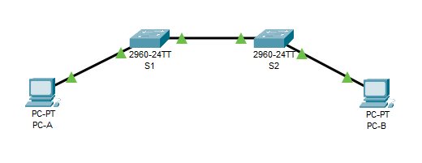

# Лабораторная работа №2. Просмотр таблицы MAC-адресов коммутатора 
### Задача:
1. Создание и настройка сети
2. Изучение таблицы МАС-адресов коммутатора

### Решение:

### Часть 1. Создание и настройка сети
### Шаг 1. Подключаем сеть в соответствии с топологией.

