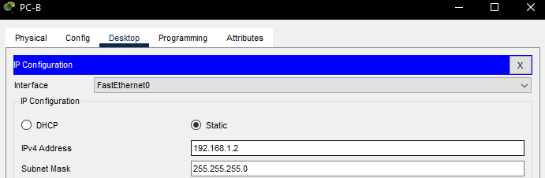

# Лабораторная работа №2. Просмотр таблицы MAC-адресов коммутатора 
### Задача:
1. Создание и настройка сети
2. Изучение таблицы МАС-адресов коммутатора

### Решение:
1. [Создание и настройка сети](https://github.com/necit137/otus_study/edit/main/lab%2002/README.md#часть-1-создание-и-настройка-сети)
    - [Шаг 1. Подключаем сеть в соответствии с топологией](https://github.com/necit137/otus_study/edit/main/lab%2002/README.md#шаг-1-подключаем-сеть-в-соответствии-с-топологией)
    - [Шаг 2. Настраиваем узлы ПК](https://github.com/necit137/otus_study/edit/main/lab%2002/README.md#шаг-2-настраиваем-узлы-пк)
    - [Шаг 3. Выполните инициализацию и перезагрузку коммутаторов](https://github.com/necit137/otus_study/edit/main/lab%2002/README.md#шаг-3-выполните-инициализацию-и-перезагрузку-коммутаторов)

### Часть 1. Создание и настройка сети
### Шаг 1. Подключаем сеть в соответствии с топологией


### Шаг 2. Настраиваем узлы ПК
Производим настройку PC-A


Производим настройку PC-B


### Шаг 3. Выполните инициализацию и перезагрузку коммутаторов
Для первичного подключения к коммутаторам **S1** и **S2**, используем PC-A. 

Командой ***erase startup-config*** удаляем все конфигурации на коммутаторе: 
```
Switch#erase startup-config 
Erasing the nvram filesystem will remove all configuration files! Continue? [confirm]
[OK]
Erase of nvram: complete
%SYS-7-NV_BLOCK_INIT: Initialized the geometry of nvram
```
после чего перезапускаем коммутатор коммандой ***reload***:
```
Switch#reload 
Proceed with reload? [confirm]
C2960 Boot Loader (C2960-HBOOT-M) Version 12.2(25r)FX, RELEASE SOFTWARE (fc4)
Cisco WS-C2960-24TT (RC32300) processor (revision C0) with 21039K bytes of memory.
2960-24TT starting...

```
